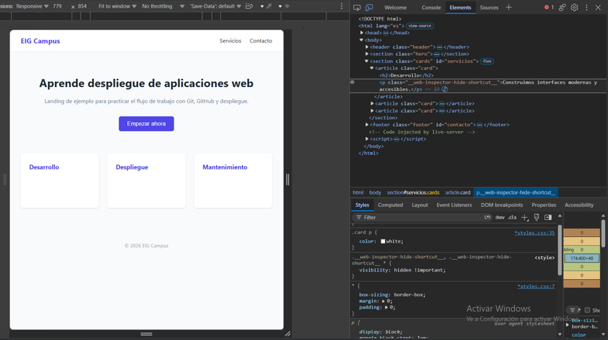
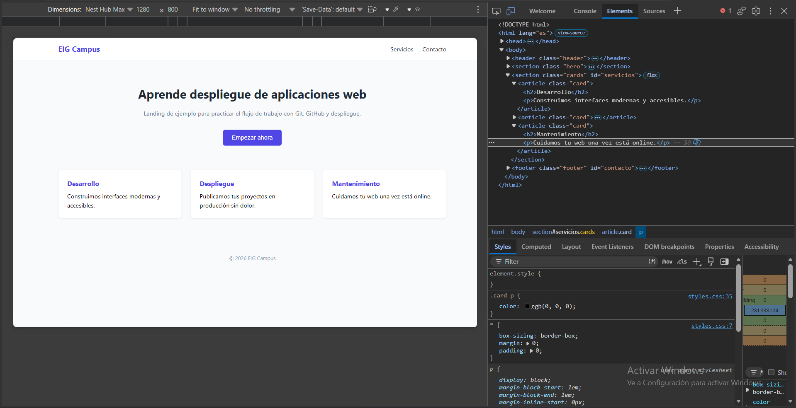

# Arreglo de bugs de despliegue-08

><em>Trabajo realizado por Emilio, Pedro y Joaquín</em>

Al comienzo, la web mostraba un claro error dentro de las cartas, siendo notoria la <strong>falta de contenido dentro de estas.</strong>

Para solucionar este problema, hemos <strong>inspeccionado la página y hemos revisado el CSS de la carta</strong> en concreto, modificando el color del párrafo de la tarjeta: lo hemos cambiado de blanco a negro para que se vea bien.

### Código antiguo:

```
.card p { color: white; }
```

### Código nuevo:

```
.card p { color: rgb(0, 0, 0); }
```

Otra solución podría ser cambiar el color de la tarjeta a uno más oscuro que deje visibles ambos textos <em>(título y párrafo)</em>.

[Repositorio.es](https://github.com/jxparra/despliegues-08)

### Cambios del bug:

#### Inicio:



#### Final:



Se muestra el incio de la web, a la izquierda la consola mostrando la linea de código en concreto que estaba erronea. <br>

Al final se ve como hemos cambiado el css, cambiando el color de la clase .card p de <strong>blanco a negro</strong> para que sea visible en la web el parráfo.
